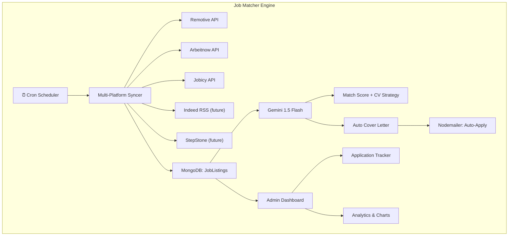

# AI Job Matcher — Future Roadmap & Technology Reference

---

## Technologies Used & Why

| Technology | Where | Why |
|---|---|---|
| **Google Gemini 1.5 Flash** | Backend → `geminiService.js` | Free tier, fast inference, excellent at structured text analysis. Chosen over OpenAI because it has a generous free tier with no credit card required. |
| **Remotive API** | Backend → `routes/jobs.js` | Free, no API key needed. Specializes in remote software dev jobs worldwide. Returns clean JSON with salary, tags, and location data. |
| **Arbeitnow API** | Backend → `routes/jobs.js` | Free, no API key needed. Focused on European jobs (Germany, Austria, Switzerland, NL). Aggregates from Greenhouse, SmartRecruiters, etc. |
| **Jobicy API** | Backend → `routes/jobs.js` | Free, no API key needed. Broad remote job coverage across industries. Provides salary ranges and geo filtering. |
| **Mongoose (MongoDB)** | Backend → `models/JobListing.js` | Flexible schema for jobs from different APIs with varying fields. Indexed for fast filtering and pagination. |
| **Axios** | Backend + Frontend | Clean HTTP client with timeout support for external API calls (backend) and JWT interceptors (frontend). |
| **React (useState, useCallback)** | Frontend → `JobMatcher.jsx` | Component state management for filters, pagination, and modals without needing a global store. |
| **Framer Motion** | Frontend → `JobMatcher.jsx` | Smooth expand/collapse animation for the platform selector panel. |

---

## Current Features (v1.0)
- ✅ Multi-platform job sync (Remotive, Arbeitnow, Jobicy)
- ✅ Platform selection before syncing
- ✅ Advanced filters: Search, Work Mode, Job Type, Country, Platform, AI Status
- ✅ Server-side pagination with record count
- ✅ Reset All button to clear database
- ✅ Reset Filters button to clear search state
- ✅ Platform source displayed in job list
- ✅ AI-powered CV analysis with Gemini (Score Breakdown, CV Must-Haves, Gap Analysis, Interview Tips)
- ✅ Mark jobs as "Applied" for tracking
- ✅ Country inference from location strings
- ✅ Latest jobs listed first (sorted by publishedAt DESC)

---

## Phase 2: Automated Application Bot (Future Work)

> [!IMPORTANT]
> This is the next evolution of the Job Matcher and requires significant architecture. Here is the detailed plan.

### 2.1 — Application Tracking Dashboard
**New Admin Page:** `/admin/jobs/applied`

Features:
- Table of all jobs marked as "Applied"
- Columns: Job Title, Company, Applied Date, Status (Submitted / Interview / Rejected / Offer)
- Status dropdown to manually update progress
- Notes field to save interview feedback
- Statistics: Total Applied, Response Rate, Interview Conversion Rate
- Chart: Applications Over Time (Recharts)

### 2.2 — CV Upload & Storage
**Implementation:**
- Add a "CV" section in the Profile Manager where you can upload your PDF resume
- Store it as a base64 string in the Profile model (or Cloudinary URL for production)
- The AI bot will parse this PDF using a library like `pdf-parse` to extract raw text
- This text becomes context for all AI operations (instead of just profile + skills)

### 2.3 — AI Auto-Apply Bot (Advanced)
**How it works:**
1. You select a job and click "Auto-Apply"
2. The bot reads your CV (parsed text) + the job description
3. It uses Gemini to generate a **tailored cover letter** specific to that company and role
4. The cover letter is displayed for your review
5. (Future) Integration with email automation (Nodemailer) to send the application to the company's HR email extracted from the job listing

**Technology Stack for the Bot:**
| Component | Technology | Reason |
|---|---|---|
| PDF Parsing | `pdf-parse` (npm) | Extract text from uploaded CV PDF |
| Cover Letter Generation | Gemini 1.5 Flash | Generate role-specific cover letters |
| Email Sending | Nodemailer | Send applications programmatically |
| Job Email Extraction | Gemini | Parse job descriptions to find HR emails |
| Queue System | `bull` + Redis (or simple cron) | Rate-limit applications to avoid spam |

### 2.4 — More Job Platforms
Expand the crawler to include:
- **LinkedIn Jobs** (via unofficial API or RSS feeds)
- **Indeed** (via RSS: `https://www.indeed.com/rss?...`)
- **StepStone Germany** (for Deutsch-language roles)
- **XING** (for DACH region)
- **Glassdoor** (for company reviews + jobs)

### 2.5 — Smart Job Alerts
- Cron job that runs `/api/jobs/sync` every 6 hours automatically
- When new jobs match your profile above 80%, send a push notification or email alert
- Configurable thresholds in admin settings

---

## Architecture Diagram (Future State)

---

> [!TIP]
> To start Phase 2, the first step is to build the Application Tracking Dashboard (2.1) since the backend `hasApplied` / `appliedAt` fields are already in place. We just need a new frontend page to visualize the data.
