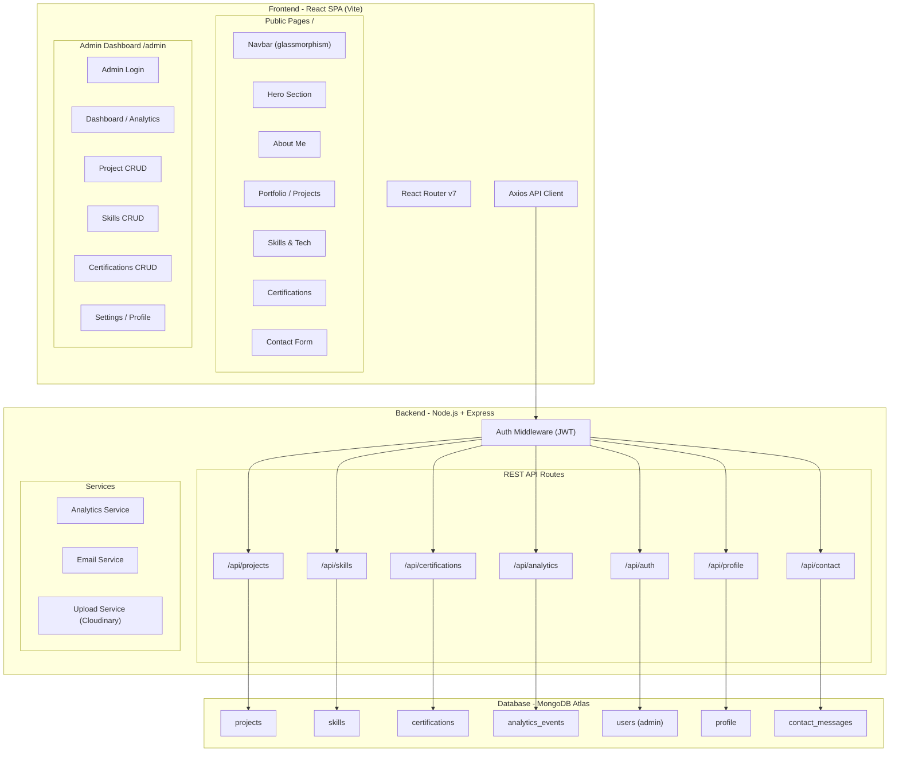
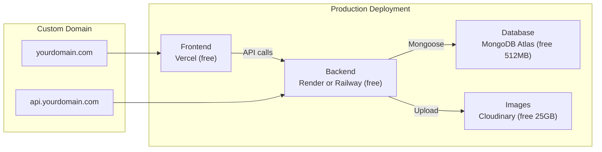
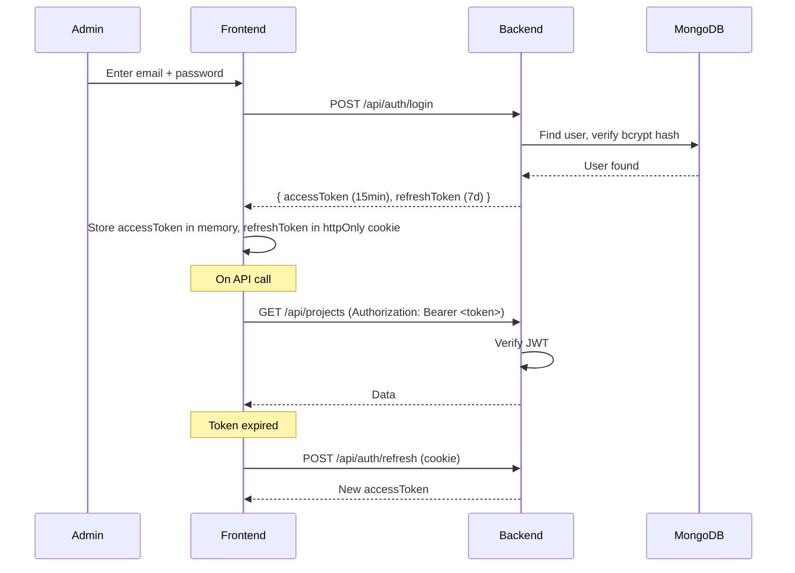

# Portfolio Showcase Website — Implementation Plan (v2)

A premium, animated single-page portfolio with a full-featured admin dashboard, backend API, database, analytics, and future AI integrations.

---

## Design Direction

````carousel

<!-- slide -->

````

### Color Palette & Theme

| Token | Dark Mode | Light Mode | Usage |
|---|---|---|---|
| `--bg-primary` | `#0A0F1C` | `#F8FAFC` | Main background |
| `--bg-secondary` | `#151B28` | `#FFFFFF` | Cards / sections |
| `--bg-glass` | `rgba(15,23,42,0.6)` | `rgba(255,255,255,0.7)` | Glassmorphism panels |
| `--accent-blue` | `#00D4FF` | `#0EA5E9` | Primary accent |
| `--accent-purple` | `#7C3AED` | `#8B5CF6` | Secondary accent |
| `--accent-gradient` | `linear-gradient(135deg, #00D4FF, #7C3AED)` | same | CTA buttons, text highlights |
| `--text-primary` | `#F1F5F9` | `#0F172A` | Headings |
| `--text-secondary` | `#94A3B8` | `#64748B` | Body text |

- **Typography**: Inter (Google Fonts)
- **Effects**: Glassmorphism, particles, floating shapes, gradient text
- **Micro-animations**: Hover scale/glow, staggered fade-in, magnetic cursor on CTAs

---

## Technology Stack — Full MERN Architecture

### My Recommendation: **Node.js + Express + MongoDB**

Here's why this is the **best fit** for your portfolio:

| Factor | MongoDB + Express (Recommended ✅) | PostgreSQL + Express | Firebase/Supabase |
|---|---|---|---|
| **Schema flexibility** | ✅ Perfect — projects/skills have varying fields | ⚠️ Requires migrations for schema changes | ✅ Flexible |
| **JS/TS everywhere** | ✅ JSON documents = native to JavaScript | ⚠️ SQL queries needed | ✅ JS SDK |
| **Speed to build** | ✅ Fastest with Mongoose ODM | ⚠️ Slower with Prisma/Knex setup | ✅ Very fast |
| **Analytics queries** | ✅ Aggregation pipeline is powerful | ✅ SQL is great for analytics | ⚠️ Limited |
| **Free hosting** | ✅ MongoDB Atlas free tier (512MB) | ✅ Railway/Render free tier | ✅ Free tier |
| **AI integration** | ✅ Store chat history, embeddings natively | ✅ pgvector extension | ⚠️ Limited |
| **Full control** | ✅ Own your code and data | ✅ Full control | ❌ Vendor lock-in |
| **Portfolio value** | ✅ Shows full-stack MERN skills | ✅ Shows SQL skills | ❌ Hides complexity |

### Complete Stack

| Layer | Technology | Rationale |
|---|---|---|
| **Frontend** | React 19 + Vite | Fastest build tool, instant HMR |
| **Routing** | React Router v7 | `/` (public) + `/admin/*` |
| **Animations** | Framer Motion 12 | GPU-accelerated, `whileInView` |
| **Smooth Scroll** | Lenis | Butter-smooth + Framer integration |
| **Styling** | Vanilla CSS + CSS Variables | Full control, theme switching |
| **Charts** | Recharts | Lightweight, React-native |
| **HTTP Client** | Axios | Clean API with interceptors for JWT |
| **Backend** | Node.js + Express.js | Same language as frontend, fast |
| **Database** | MongoDB Atlas | Free cloud tier, flexible documents |
| **ODM** | Mongoose | Schema validation, middleware hooks |
| **Auth** | JWT (access + refresh tokens) | Stateless, secure |
| **Password** | bcryptjs | Slow hash, brute-force resistant |
| **Validation** | Joi | Request body/param validation |
| **Security** | helmet + cors + rate-limiter | Production-hardened |
| **File Upload** | multer + Cloudinary | Image upload for projects/certs |
| **Email** | Nodemailer (or EmailJS fallback) | Contact form submissions |
| **Icons (Tech)** | Devicon + Simple Icons CDN | 700+ free SVG tech icons |
| **Font** | Inter (Google Fonts) | Clean, modern, variable weight |

---

## Architecture Overview



---

## Hosting Strategy



| Service | Platform | Free Tier | Notes |
|---|---|---|---|
| **Frontend** | **Vercel** | Unlimited sites, 100GB bandwidth | Auto-deploy from GitHub, global CDN |
| **Backend** | **Render** | 750 hrs/month, 512MB RAM | Auto-deploy, free SSL, sleeps after 15min inactivity |
| **Backend** (alt) | **Railway** | $5 credit/month, 512MB RAM | Stays awake longer, integrated DB provisioning |
| **Database** | **MongoDB Atlas** | 512MB storage, shared cluster | Cloud-hosted, auto-backups, global regions |
| **Images** | **Cloudinary** | 25GB storage, 25GB bandwidth | Auto-optimization, transformations, CDN |
| **Domain** | Any registrar | ~$10-15/year | Connect via DNS to Vercel + Render |

> [!TIP]
> **My hosting recommendation**: **Vercel** (frontend) + **Render** (backend) + **MongoDB Atlas** (database). This combo gives you the best free tier, excellent DX, and easy scaling when needed. Railway is a great alternative to Render if you want the DB on the same platform.

---

## Folder Structure

### Frontend (`/client`)
```
client/
├── index.html
├── package.json
├── vite.config.js
├── public/
│   └── favicon.svg
├── src/
│   ├── main.jsx
│   ├── App.jsx
│   ├── index.css                    # Design system + tokens
│   │
│   ├── api/
│   │   ├── axiosConfig.js           # Base URL, interceptors, JWT refresh
│   │   ├── projectsApi.js           # CRUD endpoints
│   │   ├── skillsApi.js
│   │   ├── certsApi.js
│   │   ├── analyticsApi.js
│   │   ├── authApi.js
│   │   └── contactApi.js
│   │
│   ├── components/
│   │   ├── AnimatedSection.jsx
│   │   ├── GlassCard.jsx
│   │   ├── GradientButton.jsx
│   │   ├── ParticleBackground.jsx
│   │   ├── SectionHeading.jsx
│   │   ├── TechIcon.jsx
│   │   ├── Modal.jsx
│   │   ├── ThemeToggle.jsx
│   │   ├── ScrollProgress.jsx
│   │   └── Loader.jsx
│   │
│   ├── layouts/
│   │   ├── PublicLayout.jsx
│   │   └── AdminLayout.jsx
│   │
│   ├── pages/
│   │   ├── public/
│   │   │   └── Home.jsx
│   │   └── admin/
│   │       ├── Login.jsx
│   │       ├── Dashboard.jsx
│   │       ├── ProjectsManager.jsx
│   │       ├── SkillsManager.jsx
│   │       └── CertsManager.jsx
│   │
│   ├── sections/
│   │   ├── HeroSection.jsx
│   │   ├── AboutSection.jsx
│   │   ├── PortfolioSection.jsx
│   │   ├── SkillsSection.jsx
│   │   ├── CertificationsSection.jsx
│   │   └── ContactSection.jsx
│   │
│   ├── context/
│   │   ├── DataContext.jsx
│   │   ├── ThemeContext.jsx
│   │   └── AuthContext.jsx
│   │
│   ├── hooks/
│   │   ├── useScrollProgress.js
│   │   ├── useSmoothScroll.js
│   │   └── useAnalytics.js
│   │
│   └── utils/
│       ├── constants.js
│       └── helpers.js
```

### Backend (`/server`)
```
server/
├── package.json
├── server.js                        # Entry point
├── .env.example                     # Environment variable template
│
├── config/
│   ├── db.js                        # MongoDB connection
│   ├── cloudinary.js                # Image upload config
│   └── cors.js                      # CORS whitelist
│
├── models/
│   ├── User.js                      # Admin user schema
│   ├── Project.js
│   ├── Skill.js
│   ├── Certification.js
│   ├── AnalyticsEvent.js
│   ├── ContactMessage.js
│   └── Profile.js                   # About me / personal info
│
├── routes/
│   ├── auth.js                      # POST /login, /register, /refresh
│   ├── projects.js                  # CRUD + GET public
│   ├── skills.js
│   ├── certifications.js
│   ├── analytics.js                 # POST event, GET aggregates
│   ├── contact.js                   # POST message, GET all (admin)
│   └── profile.js                   # GET/PUT personal info
│
├── middleware/
│   ├── auth.js                      # JWT verification
│   ├── errorHandler.js              # Global error handler
│   ├── rateLimiter.js               # Rate limiting
│   └── validate.js                  # Joi validation middleware
│
├── services/
│   ├── emailService.js              # Nodemailer config
│   └── analyticsService.js          # Aggregation queries
│
├── validators/
│   ├── projectValidator.js          # Joi schemas
│   ├── skillValidator.js
│   └── contactValidator.js
│
└── utils/
    ├── generateToken.js             # JWT sign helper
    └── seedData.js                  # Initial data seeder
```

---

## API Endpoints

### Public Endpoints (no auth required)

| Method | Endpoint | Description |
|---|---|---|
| `GET` | `/api/profile` | Get personal info (name, bio, photo, social links) |
| `GET` | `/api/projects` | List all projects (with filters: `?category=web&featured=true`) |
| `GET` | `/api/projects/:id` | Single project details |
| `GET` | `/api/skills` | List all skills grouped by category |
| `GET` | `/api/certifications` | List all certifications |
| `POST` | `/api/contact` | Submit contact form message |
| `POST` | `/api/analytics/event` | Track a visitor event (page view, click, etc.) |

### Protected Endpoints (JWT required — admin only)

| Method | Endpoint | Description |
|---|---|---|
| `POST` | `/api/auth/login` | Admin login → returns JWT tokens |
| `POST` | `/api/auth/refresh` | Refresh access token |
| `POST` | `/api/auth/logout` | Invalidate refresh token |
| **Projects** | | |
| `POST` | `/api/projects` | Create project (with image upload) |
| `PUT` | `/api/projects/:id` | Update project |
| `DELETE` | `/api/projects/:id` | Delete project |
| `PATCH` | `/api/projects/reorder` | Reorder projects (drag & drop) |
| **Skills** | | |
| `POST` | `/api/skills` | Create skill |
| `PUT` | `/api/skills/:id` | Update skill |
| `DELETE` | `/api/skills/:id` | Delete skill |
| **Certifications** | | |
| `POST` | `/api/certifications` | Create certification |
| `PUT` | `/api/certifications/:id` | Update |
| `DELETE` | `/api/certifications/:id` | Delete |
| **Analytics** | | |
| `GET` | `/api/analytics/overview` | Aggregated stats (totals, trends) |
| `GET` | `/api/analytics/visitors` | Visitor data over time period |
| `GET` | `/api/analytics/top-projects` | Most viewed projects |
| `GET` | `/api/analytics/sections` | Section view breakdown |
| **Contact** | | |
| `GET` | `/api/contact` | List all contact submissions |
| `PATCH` | `/api/contact/:id/read` | Mark as read |
| `DELETE` | `/api/contact/:id` | Delete message |
| **Profile** | | |
| `PUT` | `/api/profile` | Update personal info |

---

## Database Schemas (Mongoose)

### User (Admin)
```js
{
  email: { type: String, required: true, unique: true },
  password: { type: String, required: true },  // bcrypt hashed
  refreshToken: String,
  createdAt: Date
}
```

### Profile
```js
{
  name: String,
  title: String,              // "Full Stack Developer"
  bio: String,                // Rich text / markdown
  photo: String,              // Cloudinary URL
  resume: String,             // Cloudinary URL
  email: String,
  phone: String,
  location: String,
  social: {
    github: String,
    linkedin: String,
    twitter: String,
    website: String
  },
  stats: {
    yearsExperience: Number,
    projectsCompleted: Number,
    happyClients: Number
  }
}
```

### Project
```js
{
  title: String,
  slug: String,               // URL-friendly
  description: String,        // Short
  longDescription: String,    // Markdown
  thumbnail: String,          // Cloudinary URL
  images: [String],
  techStack: [String],        // ["react", "nodejs", "mongodb"]
  liveUrl: String,
  githubUrl: String,
  category: { type: String, enum: ["web", "mobile", "ai", "backend", "other"] },
  featured: { type: Boolean, default: false },
  order: Number,
  views: { type: Number, default: 0 },
  createdAt: Date,
  updatedAt: Date
}
```

### Skill
```js
{
  name: String,
  icon: String,               // Devicon slug e.g. "react", "nodejs"
  category: { type: String, enum: ["frontend", "backend", "database", "devops", "tools", "language"] },
  proficiency: { type: Number, min: 0, max: 100 },
  order: Number
}
```

### Certification
```js
{
  title: String,
  issuer: String,
  issueDate: Date,
  expiryDate: Date,
  credentialUrl: String,
  badgeImage: String,         // Cloudinary URL
  order: Number
}
```

### AnalyticsEvent
```js
{
  type: { type: String, enum: ["page_view", "section_view", "project_click", "contact_submit", "resume_download"] },
  target: String,             // Section name or project ID
  sessionId: String,          // UUID generated client-side
  ip: String,                 // Hashed for privacy
  referrer: String,
  userAgent: String,
  country: String,            // From IP geolocation (free API)
  screenSize: String,
  timestamp: { type: Date, default: Date.now },
  duration: Number            // Time spent in seconds (for sections)
}
// Index: { timestamp: -1 }, { sessionId: 1 }, { type: 1 }
```

### ContactMessage
```js
{
  name: String,
  email: String,
  subject: String,
  message: String,
  isRead: { type: Boolean, default: false },
  createdAt: { type: Date, default: Date.now }
}
```

---

## Section-by-Section Design

### 1. Hero Section
- Full viewport with animated gradient background
- Typewriter greeting: "Hello, I'm **[Name]**"
- Subtitle fade-in: "Software Developer · Problem Solver · Creator"
- Floating geometric shapes (CSS `@keyframes`)
- Particle background canvas
- CTAs: "View My Work" (scroll) + "Download Resume"
- Scroll indicator bouncing at bottom

### 2. About Me
- Split layout: Photo (gradient border) | Bio text
- Animated stat counters (data from Profile API)
- Staggered `whileInView` fade-in
- Timeline journey with animated connecting line

### 3. Portfolio / Projects
- Filter tabs (All, Web, Mobile, AI) with animated underline
- Masonry grid with 3D tilt hover effect
- Cards: thumbnail, title, tech icons, description
- Expandable modal with full details + gallery
- Featured projects get gradient border glow

### 4. Skills & Technologies
- Grouped by category in rounded cards
- **Devicon SVG** + name + animated proficiency bar
- Staggered entrance, hover glow effect
- Category filter pills

### 5. Certifications
- Horizontal scrollable carousel
- Badge, title, issuer, date, "Verify" link
- Glassmorphism cards with hover lift

### 6. Contact Me
- Split: Form | Info (email, LinkedIn, GitHub, location)
- Floating label animations
- Sends to backend → stored in DB + email notification
- Toast notifications with animation

---

## Admin Dashboard Features

### Authentication Flow


### Dashboard Analytics
- **Stat Cards**: Total views, unique sessions, most viewed project, contact count
- **Visitor Trend Chart**: Recharts line chart (7/30/90 days)
- **Top Projects**: Bar chart by views
- **Section Heatmap**: Which sections get most views
- **Recent Activity**: Latest events feed
- **Geographic Distribution**: Visitors by country (from IP geolocation)

### Content Management
- **Projects**: Table + modal form with Cloudinary image upload, drag-to-reorder
- **Skills**: Grid with icon search autocomplete, proficiency slider
- **Certifications**: List with add/edit/delete
- **Contact Messages**: Inbox view with read/unread status
- **Profile**: Edit personal info, upload photo/resume

---

## Technology Icons Strategy

```
<!-- Devicon CDN (primary) -->
https://cdn.jsdelivr.net/gh/devicons/devicon@latest/icons/{slug}/{slug}-original.svg

<!-- Simple Icons CDN (fallback) -->
https://cdn.simpleicons.org/{slug}
```

The `TechIcon` component tries Devicon → Simple Icons → generic fallback, with caching.

---

## Security Practices

| Practice | Implementation |
|---|---|
| Password hashing | bcryptjs with 12 salt rounds |
| JWT tokens | Short-lived access (15min) + refresh (7d) |
| Input validation | Joi schemas on all routes |
| Rate limiting | express-rate-limit (100 req/15min general, 5/15min on login) |
| CORS | Whitelist frontend domain only |
| Helmet | Security headers (CSP, X-Frame, HSTS) |
| MongoDB injection | Mongoose sanitizes by default + express-mongo-sanitize |
| XSS | DOMPurify on frontend for rendered content |
| HTTPS | Enforced by hosting providers |
| Env variables | dotenv, never commit secrets |

---

## Animation Plan

| Element | Animation | Library | Trigger |
|---|---|---|---|
| Page load | Fade in + slide up | Framer Motion | Mount |
| Navbar | Glassmorphism on scroll | CSS + scroll | Scroll |
| Hero text | Typewriter | Custom hook | Mount |
| Floating shapes | Rotate + float | CSS keyframes | Always |
| Particles | Canvas particles | Custom | Always |
| Section headings | Slide up + fade | Framer Motion | `whileInView` |
| Project cards | Staggered fade, 3D tilt | Framer Motion | `whileInView` + hover |
| Skill bars | Width → proficiency % | Framer Motion | `whileInView` |
| Cert carousel | Horizontal drag | Framer Motion | Gesture |
| Form labels | Float on focus | CSS | Focus |
| Smooth scroll | Butter-smooth | Lenis | Always |
| Theme toggle | Sun↔Moon morph | Framer Motion | Click |
| Modals | Scale + backdrop blur | AnimatePresence | Toggle |
| Scroll progress | Top bar width | `useScroll` | Scroll |

---

## Future AI Integrations

> [!TIP]
> Ranked by value — we'll build the chatbot shell now, ready for API integration later:

### 1. 🤖 Smart Portfolio Chatbot
Visitors can ask about your skills, projects, experience. Uses OpenAI/Gemini API with your portfolio data as context. Rule-based FAQ fallback if no API key.

### 2. 🧠 AI-Powered Project Recommendations
"Based on your interests..." carousel — tracks browsing behavior, recommends related projects using content-based filtering.

### 3. 📊 AI Analytics Insights
Auto-generated insights: "Your React Calculator is trending — 3x more views this week." Shows in admin dashboard.

### 4. ✍️ AI Content Assistant (Admin)
"✨ Enhance with AI" button in project editor — polishes descriptions, suggests tags, generates SEO meta.

### 5. 🎨 Dynamic Theme Generation
AI-suggested color palettes based on mood/season.

---

## User Review Required

> [!IMPORTANT]
> **Please confirm these decisions:**

1. **Stack Confirmed?** → Node.js + Express + MongoDB Atlas (MERN). Good to proceed?

2. **Image Storage** → Planning to use **Cloudinary** (free: 25GB storage, 25GB bandwidth/month) for project thumbnails, cert badges, and profile photo. OK?

3. **Contact Form** → Messages will be saved to MongoDB AND trigger an email notification to you via **Nodemailer** (you'll configure your email/SMTP in `.env`). OK?

4. **Hosting Preference** → Recommending **Vercel** (frontend) + **Render** (backend) + **MongoDB Atlas** (DB). Any preference for Railway instead of Render?

5. **Your Personal Info** → I'll use placeholder text. You'll update via admin panel. Want me to use a specific name/title for now?

6. **AI Chatbot** → Should I build the chatbot UI shell now with a rule-based fallback? (API integration can be added later with your OpenAI/Gemini key)

---

## Verification Plan

### Automated
- `npm run build` — zero errors on both client and server
- Start backend → test all API endpoints via browser tool
- Browser test: full public site navigation + admin CRUD flow
- Lighthouse performance audit

### Manual
- Visual inspection against design mockups
- Dark/light theme toggle
- Admin login → CRUD → verify public site reflects changes
- Contact form → verify DB storage + email
- Responsive layout on mobile viewport
- Smooth scroll + all animations working

---

## Execution Phases

| Phase | Scope | Est. Files |
|---|---|---|
| **1** | Backend setup: Express, MongoDB, models, auth routes | ~15 |
| **2** | Backend CRUD routes: projects, skills, certs, contact, analytics | ~12 |
| **3** | Frontend setup: Vite + React, routing, design system, layouts | ~10 |
| **4** | Public sections (Hero → Contact) with all animations | ~12 |
| **5** | API integration: connect frontend to backend | ~8 |
| **6** | Admin dashboard: login, analytics, CRUD pages | ~8 |
| **7** | Analytics tracking + charts | ~4 |
| **8** | Polish: responsive, theme toggle, final animations, security | ~3 |
| **9** | (Future) AI chatbot shell + recommendations | ~3 |

**Total estimated: ~75 files across frontend and backend**
